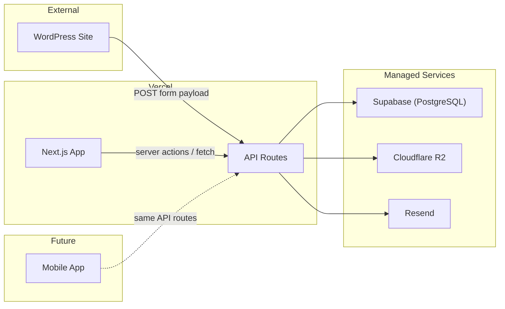

# Quote Management System – Architecture

**Version:** 2.0  
**Last Updated:** March 2026  
**Related docs:** [REQUIREMENTS.md](REQUIREMENTS.md) | [STRATEGY.md](STRATEGY.md)

This document describes **how** the system is built: components, data flow, integrations, and tech choices. AI agents should follow it for implementation and consistency.

---

## Table of Contents

1. [High-Level Architecture](#high-level-architecture)
2. [WordPress Integration](#wordpress-integration)
3. [Data Flow](#data-flow)
4. [Tech Stack](#tech-stack)
5. [Key Design Decisions](#key-design-decisions)
6. [Security](#security)
7. [File Layout](#file-layout)

---

## High-Level Architecture



- **Single Next.js application** deployed to Vercel. API routes (`app/api/`) serve as the backend; pages (`app/`) serve as the frontend. No separate backend server.
- **WordPress site** (existing) submits form data to our API route at `/api/webhooks/quote-request`.
- **Portal pages** (authenticated) and **public quote page** (unauthenticated, by token) are both part of the same Next.js app.
- **Managed services:** Supabase (PostgreSQL), Cloudflare R2 (file storage), Resend (email).
- **Mobile app** (future) will call the same API routes over HTTP.

---

## WordPress Integration

### Webhook endpoint

- **URL:** `POST /api/webhooks/quote-request`
- **Purpose:** Accept form submissions from the WordPress site and create a quote request (or draft quote) in the system.

### Payload contract (expected from WordPress)

Based on the "Get a quote" form on [bosssecurity.ca](https://bosssecurity.ca/):

| Field       | Type   | Required | Description                    |
|------------|--------|----------|--------------------------------|
| `name`     | string | yes      | Customer / contact name        |
| `email`    | string | yes      | Customer email address          |
| `phone`    | string | no       | Customer phone number            |
| `service`  | string | no       | Service interested in (e.g. "Static Guard Services", "Mobile Patrols", "CCTV Installation", "Remote Video Monitoring") |
| `cities`   | string[] | no    | Cities selected (e.g. ["Winnipeg", "Calgary"]). WordPress may send as comma-separated string; API should accept both array and CSV. |
| `message`  | string | no       | Free-text message or details   |
| `source_url` | string | no    | Page URL where form was submitted (auto-filled by WordPress) |
| `idempotency_key` | string | no | Optional; deduplicate repeated submissions |

**Validation:** Reject with `400` if required fields missing or invalid. Return `201` with created resource identifier on success. On duplicate `idempotency_key`, return `200` and existing resource (or `409` as per policy).

### Webhook security

- Verify requests using a **shared secret** or **HMAC** (e.g. header `X-Webhook-Signature`) so only the WordPress site can submit.
- Document the expected signature algorithm and header name for the WordPress integration.

### Result

- On success, the backend creates a **quote request** (or draft quote) in the database and it appears in the portal list.

---

## Data Flow

1. **Quote request in:** WordPress form → API route (webhook) → creates record in Supabase → Portal list shows new request.
2. **Finalise quote:** User finalises in Portal → API route generates cryptographically random token, stores default message → link and message available in Portal.
3. **Copy to Outlook:** User clicks "Copy" in Portal → clipboard gets default message (including link); user pastes in Outlook and sends manually.
4. **Customer opens link:** Customer opens link → public quote page (`/q/[token]`) loads quote by token from DB; customer can view, print-to-PDF, sign, accept.
5. **Accept:** Customer accepts (and optionally signs) → API route updates status, sends "quote accepted" emails via Resend to admin and sales rep, dashboard data reflects new status.

---

## Tech Stack

| Layer | Technology | Notes |
|-------|------------|-------|
| **App + API** | Next.js 14+ (App Router) on **Vercel** | API routes = backend (serverless functions). Pages = frontend (SSR/static). Single deploy. |
| **Database** | **Supabase** (managed PostgreSQL) | Free tier: 500 MB storage. Built-in connection pooling (PgBouncer) for serverless compatibility. |
| **ORM** | Prisma | Type-safe DB access and migrations. Connects to Supabase via pooled connection string. |
| **Auth** | NextAuth / Auth.js | Credentials provider + role-based access (ADMIN, SALES). |
| **Storage** | **Cloudflare R2** | Profile photos. Free tier: 10 GB, no egress fees. |
| **PDF** | **Browser print-to-PDF** | `@media print` CSS + `window.print()`. No server-side generation. See [Design Decisions](#key-design-decisions). |
| **Email** | **Resend** | "Quote accepted" notifications only. Free tier: 3,000 emails/month. |
| **Mobile** | React Native + Expo (future) | Calls the same API routes. In scope per REQUIREMENTS. |
| **UI** | TailwindCSS + shadcn/ui | Utility-first styling; accessible component primitives. |
| **Validation** | Zod | Request validation in API routes and forms. |

### Why TypeScript over Java/Spring Boot

The project lead is a Java/Spring Boot developer. The decision to use TypeScript was made deliberately after weighing the following trade-offs:

| Factor | Java / Spring Boot | TypeScript / Node.js | Winner |
|--------|-------------------|----------------------|--------|
| Code review familiarity | Native expertise | Learning curve (weeks, not months — TS types/classes/interfaces map well from Java) | Java |
| Memory footprint | 350-500 MB idle (JVM) | 50-80 MB idle (V8) | **TypeScript (4-6x less)** |
| Hosting cost (usage-based) | ~$10-15/mo compute | $0 on Vercel serverless | **TypeScript** |
| Cold start (container) | 5-15 seconds | 0.5-2 seconds | **TypeScript** |
| Scale-to-zero viable | No (cold start too slow for customer-facing link) | Yes | **TypeScript** |
| PDF generation | OpenPDF/iText (binary layout) | Browser print-to-PDF (just CSS) | **TypeScript** |
| One language for full stack | Backend only; frontend still JS/TS | Backend + frontend + mobile share one language | **TypeScript** |

**Decision:** Use TypeScript across the full stack. Mitigate the learning curve by enforcing thorough documentation and pros/cons analysis before every implementation step (see `.cursor/rules/document-before-implementing.mdc`).

### Hosting and cost

Target: **$0/month** at current volume (<100 quotes/month).

| Component | Platform | ~Monthly cost |
|-----------|----------|---------------|
| Next.js app + API routes | Vercel free tier | $0 |
| PostgreSQL | Supabase free tier (500 MB) | $0 |
| Object storage | Cloudflare R2 free tier (10 GB) | $0 |
| Email | Resend free tier (3K emails/mo) | $0 |
| **Total** | | **$0/month** |

Vercel free tier limits: 100 GB bandwidth, 100 hours serverless function execution, 10-second function timeout. All well within range for this volume. If limits are exceeded, Vercel Pro is $20/month.

---

## Key Design Decisions

- **Single Next.js app (no separate backend):** One project, one deploy, one framework to learn. API routes run as Vercel serverless functions. Locally, `npm run dev` runs everything on `localhost:3000`. If a separate backend is ever needed (e.g. heavy background processing), API route handlers can be extracted to a standalone Express/Fastify server with minimal refactoring since they are plain TypeScript functions.
- **HubSpot-style public quote page:** The public quote page (`/q/[token]`) is a branded, styled HTML page (like a HubSpot proposal) that includes: company branding, full quote details, and the sales rep's name, title, and photo. The page itself is the "document" — no separate PDF template to maintain. `@media print` CSS hides the accept form and navigation, producing a clean printable/saveable PDF via the browser's native print dialog. Trade-off: the customer sees a browser print dialog instead of an instant file download; acceptable for this workflow.
- **Typed signature (no canvas):** The accept flow uses plain text inputs (name + title) and a checkbox, not a drawn canvas signature. This eliminates the `react-signature-canvas` library, Base64 image storage, and mobile UX issues with finger drawing. Typed electronic signatures have the same legal validity as drawn ones under ESIGN/UETA. Signature record stored as: `{ signedBy, title, agreedAt, ipAddress, emailVerified }`.
- **Email verification before signing (optional):** Configurable flag on the quote (or global admin setting). When enabled, the accept flow adds a step: system sends a one-time code (e.g. 6-digit, short-lived) to the customer's email via Resend; customer enters the code before the accept form is submitted. Implementation: API route generates code, stores hash + expiry in DB, sends via Resend; a second API route verifies the code. Low complexity — reuses the existing Resend integration and adds one DB column and two short API routes. Not required for MVP launch; can be added in Phase 4 (polish) or later.
- **Single-tenant:** One database; no tenant_id in schema unless needed later.
- **Unique link:** Cryptographically random token (e.g. 32 bytes, URL-safe), stored and mapped to quote in DB. No sequential or guessable IDs in the public URL.
- **Quote owner:** Each quote is linked to a user (sales rep) for page/PDF attribution (name, title, photo) and for "quote accepted" email recipient.
- **Dashboard totals:** "Estimate total" and "Accepted total" for current month computed from DB (status + date filters) or materialised/cached if performance requires.

---

## Security

- **Webhook:** Verify every request with shared secret or HMAC; reject unsigned or invalid requests.
- **Public quote page:** Only the token in the path; no PII in URL; token must be unguessable and tied to a single quote.
- **Portal:** Session-based auth (NextAuth); admin-only routes for user management (create/disable/delete users).
- **Data:** Passwords hashed; sensitive data not logged; audit events for create/finalise/accept.
- **Supabase:** Row-level security (RLS) disabled; access controlled at the application layer via Prisma + auth middleware. Supabase service-role key used only server-side, never exposed to the client.

---

## File Layout

Single Next.js project. No monorepo tooling needed. AI agents should place new code under the appropriate directory.

```
quote-management-system/
├── app/                          # Next.js App Router
│   ├── (portal)/                 # Authenticated portal pages (route group)
│   │   ├── dashboard/
│   │   │   └── page.tsx
│   │   ├── quotes/
│   │   │   ├── page.tsx          # Quote list
│   │   │   └── [id]/
│   │   │       └── page.tsx      # Quote detail / edit / finalise
│   │   ├── users/
│   │   │   └── page.tsx          # Admin: user management
│   │   └── layout.tsx            # Portal shell (sidebar, nav, auth guard)
│   ├── q/
│   │   └── [token]/
│   │       └── page.tsx          # Public quote page (no auth, print-to-PDF)
│   ├── login/
│   │   └── page.tsx
│   ├── api/                      # API routes (serverless functions)
│   │   ├── webhooks/
│   │   │   └── quote-request/
│   │   │       └── route.ts      # POST: WordPress webhook
│   │   ├── auth/
│   │   │   └── [...nextauth]/
│   │   │       └── route.ts      # NextAuth handlers
│   │   ├── quotes/
│   │   │   ├── route.ts          # GET (list), POST (create)
│   │   │   └── [id]/
│   │   │       ├── route.ts      # GET, PUT, DELETE
│   │   │       ├── finalise/
│   │   │       │   └── route.ts  # POST: finalise + generate link
│   │   │       └── accept/
│   │   │           └── route.ts  # POST: customer accepts
│   │   ├── users/
│   │   │   └── route.ts          # GET, POST (admin only)
│   │   └── upload/
│   │       └── route.ts          # POST: profile photo upload to R2
│   └── layout.tsx                # Root layout
├── lib/                          # Shared server-side logic
│   ├── db.ts                     # Prisma client singleton
│   ├── auth.ts                   # NextAuth config
│   ├── email.ts                  # Resend helpers
│   ├── storage.ts                # R2 upload/download helpers
│   └── validators.ts             # Zod schemas for request validation
├── components/                   # React UI components
│   ├── ui/                       # shadcn/ui primitives
│   ├── quote-builder/            # Quote creation/editing
│   ├── dashboard/                # Dashboard widgets
│   └── accept-form.tsx           # Typed signature + accept checkbox
├── prisma/
│   ├── schema.prisma             # Database schema
│   └── migrations/               # Migration history
├── public/                       # Static assets
├── docs/
│   ├── REQUIREMENTS.md
│   ├── ARCHITECTURE.md
│   └── STRATEGY.md
├── .cursor/rules/                # Cursor rules
├── .env.local                    # Local env vars (not committed)
├── package.json
├── tsconfig.json
├── next.config.js
└── tailwind.config.ts
```

Key conventions:
- **`app/api/`** = backend. Each `route.ts` is a serverless function on Vercel, a regular HTTP handler locally.
- **`app/(portal)/`** = authenticated pages. The parentheses make this a route group (does not appear in the URL); applies a shared layout with auth guard.
- **`app/q/[token]/`** = public quote page. No auth required.
- **`lib/`** = shared server logic (equivalent to Spring `@Service` classes). Imported by API routes and server components.
- **`components/`** = React UI components. Client-side only.
- **`prisma/`** = schema and migrations. Connects to Supabase.

---

For **what** to build, see [REQUIREMENTS.md](REQUIREMENTS.md). For **in what order** to build, see [STRATEGY.md](STRATEGY.md).
