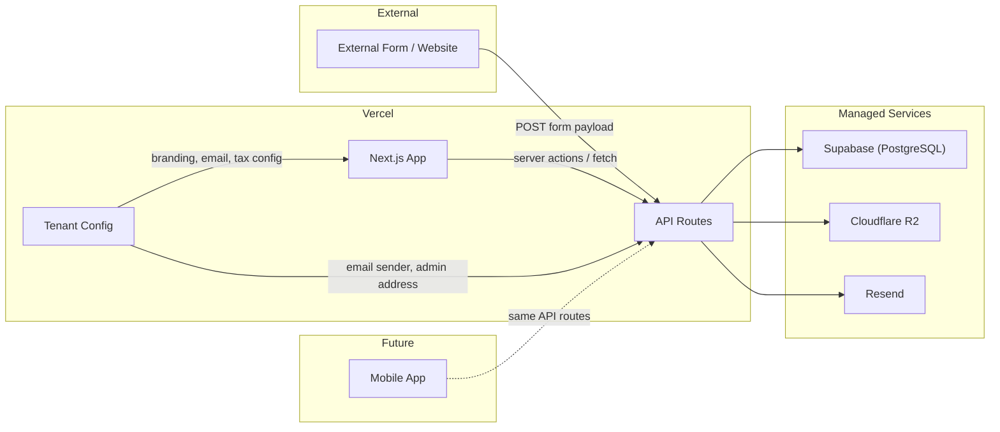

# Quote Management System – Architecture

**Version:** 3.0  
**Last Updated:** April 2026  
**Related docs:** [REQUIREMENTS.md](REQUIREMENTS.md) | [STRATEGY.md](STRATEGY.md) | [DESIGN-hourly-service-and-pst.md](DESIGN-hourly-service-and-pst.md) | [PRODUCT-PLAN.md](PRODUCT-PLAN.md)

This document describes **how** the system is built: components, data flow, integrations, and tech choices. AI agents should follow it for implementation and consistency.

---

## Table of Contents

1. [High-Level Architecture](#high-level-architecture)
2. [Tenant Configuration](#tenant-configuration)
3. [Webhook Integration](#webhook-integration)
4. [Data Flow](#data-flow)
5. [Tech Stack](#tech-stack)
6. [Key Design Decisions](#key-design-decisions)
7. [Security](#security)
8. [File Layout](#file-layout)

---

## High-Level Architecture



- **Single Next.js application** deployed to Vercel. API routes (`app/api/`) serve as the backend; pages (`app/`) serve as the frontend. No separate backend server.
- **Tenant configuration** (`config/tenant.ts`) centralises all customer-specific values (company name, branding, email addresses, tax labels). Currently reads from environment variables; designed to support DB-backed settings in future phases.
- **External form/website** submits lead data to our API route at `/api/webhooks/quote-request`. The webhook is generic — any source can integrate using HMAC-SHA256 signed requests.
- **Portal pages** (authenticated) and **public quote page** (unauthenticated, by token) are both part of the same Next.js app.
- **Managed services:** Supabase (PostgreSQL), Cloudflare R2 (file storage), Resend (email).
- **Mobile app** (future) will call the same API routes over HTTP.

---

## Tenant Configuration

All customer-specific values are centralised in `config/tenant.ts`. No hardcoded company names, email addresses, or branding anywhere in the codebase.

### How it works

`getTenantConfig()` returns a `TenantConfig` object read from environment variables:

| Config | Env var | Default | Used in |
|--------|---------|---------|---------|
| Company name | `COMPANY_NAME` | "Quote Portal" | Login, nav, public quote, emails, metadata |
| Tagline | `COMPANY_TAGLINE` | — | Public quote (premium only) |
| Phone | `COMPANY_PHONE` | — | Public quote, print footer (premium only) |
| Website | `COMPANY_WEBSITE` | — | Public quote, print footer (premium only) |
| Logo URL | `COMPANY_LOGO_URL` | — | Public quote header |
| Primary color | `PRIMARY_COLOR` | "#000000" | Portal sidebar bg, public quote header bg |
| Secondary color | `SECONDARY_COLOR` | — | Buttons (Accept, Save), active nav — premium only |
| Font color | `FONT_COLOR` | Auto-computed | Text on primary-colored surfaces — premium only |
| Background color | `BACKGROUND_COLOR` | — | Portal content area + public quote page bg — premium only |
| Email from name | `EMAIL_FROM_NAME` | Company name | Email sender display name |
| Email from address | `EMAIL_FROM_ADDRESS` | "noreply@example.com" | Email sender address |
| Email admin address | `EMAIL_ADMIN_ADDRESS` | "admin@example.com" | Notification recipient |
| Premium branding | `PREMIUM_BRANDING` | false | Gated features (tagline, phone, website) |
| Tax 1 label | `TAX1_LABEL` | "GST" | Quote builder, public quote |
| Tax 2 label | `TAX2_LABEL` | "PST" | Quote builder, public quote |
| Locale | `LOCALE` | "en-CA" | Number/date formatting |
| Currency | `CURRENCY` | "CAD" | Currency display |

### Server vs client components

Tenant config uses server-only env vars (no `NEXT_PUBLIC_` prefix). For client components, the pattern is:

1. Server component calls `getTenantConfig()`
2. Passes needed values as props to the client component
3. Client component renders using those props

Examples: `app/(portal)/layout.tsx` passes `companyName` to `PortalNav`; `app/q/[token]/page.tsx` passes the full `tenant` object to `PublicQuote`.

### DB-backed settings (Phase G2)

The `TenantSettings` DB table stores branding config as a singleton row (id = "default"). Two entry points:

- **`loadTenantConfig()`** (async) — reads from DB first, falls back to env vars. Use in server components and API routes.
- **`getTenantConfig()`** (sync) — reads from env vars only. Use only where async is not possible (e.g. module-level `metadata` exports in `layout.tsx`).

Admins edit settings via the Settings page (`/settings`). Changes take effect immediately on next page load (no cache, no restart).

### Design decisions — settings storage and loading

**Storage:** Singleton DB row chosen over JSON file (can't edit via portal, doesn't work on serverless read-only filesystem) and env-vars-only (no self-service, requires redeploy). See [STRATEGY.md — Phase G2](STRATEGY.md) for full pros/cons.

**Loading:** Direct DB read per request (with Next.js per-render deduplication) chosen over in-memory TTL cache (stale data, complexity). Settings change rarely; the ~5ms DB call is negligible.

**UI:** Single page with sections chosen over tabbed page (extra complexity for ~12 fields) and wizard (better for onboarding in G4). Basic section always editable; premium section greyed out with "Upgrade to Premium" badge when `premiumBranding` is false.

### Theme colors (premium)

Four colors drive the full visual theme (all premium-gated):

| Color | Field | Applied to |
|-------|-------|-----------|
| Primary | `primaryColor` | Portal sidebar background, public quote header background |
| Secondary / Accent | `secondaryColor` | Portal active nav highlight, action buttons (Accept, Save) |
| Font on brand | `fontColor` | Text inside sidebar and quote header; auto-computed (WCAG contrast) if not set |
| Background | `backgroundColor` | Portal content area background, public quote page background |

**Color extraction:** When a logo URL is set, admins can click "Extract Palette from Logo" in the Settings page (premium section). The browser loads the image into a canvas and uses `color-thief-browser` to extract a 6-color palette. The dominant color is auto-assigned to `primaryColor`, the second to `secondaryColor`, and `fontColor` is auto-computed for WCAG readability. The admin can then fine-tune all four colors with individual pickers and a "Reset to defaults" option. Palette extraction requires the image server to support CORS; failures are surfaced with a user-friendly message.

**`readableFontColor(bgHex)`** in `lib/utils.ts`: Uses the WCAG 2.1 relative luminance formula to determine whether white (`#ffffff`) or near-black (`#1a1a1a`) provides better contrast against a given background hex. Used everywhere auto-computed font colors are needed.

---

## Webhook Integration

### Webhook endpoint

- **URL:** `POST /api/webhooks/quote-request`
- **Purpose:** Accept lead/quote request submissions from any external form and create a quote request in the system.

### Payload contract

| Field       | Type   | Required | Description                    |
|------------|--------|----------|--------------------------------|
| `name`     | string | yes      | Customer / contact name        |
| `email`    | string | yes      | Customer email address          |
| `phone`    | string | no       | Customer phone number            |
| `service`  | string | no       | Service interested in           |
| `cities`   | string[] | no    | Cities/regions. API accepts both array and CSV. |
| `message`  | string | no       | Free-text message or details   |
| `source_url` | string | no    | Page URL where form was submitted |
| `idempotency_key` | string | no | Optional; deduplicate repeated submissions |

**Validation:** Reject with `400` if required fields missing or invalid. Return `201` with created resource identifier on success. On duplicate `idempotency_key`, return `200` and existing resource.

### Webhook security

- Verify requests using **HMAC-SHA256** via the `X-Webhook-Signature` header and the `WEBHOOK_SECRET` env var.
- Only signed requests are accepted.

### Result

- On success, the backend creates a **quote request** in the database and it appears in the portal list.

---

## Data Model

| Model | Purpose |
|-------|---------|
| `User` | Sales reps and admins. `name`, `title`, `photoUrl` appear on the public quote page. Soft-deleted via `active: false`. |
| `TenantSettings` | Singleton row (id = "default") storing branding, email, tax, and locale config. Admins edit via Settings page. |
| `Product` | Admin-managed product/service catalog. `name`, `sku`, `description`, `category`, `defaultPrice`, `unit`. Used by quote builder to pre-fill line items. Soft-deleted via `active: false`. |
| `QuoteTemplate` | Admin-managed named set of line items. Can be loaded into a draft quote to pre-fill all items at once. |
| `QuoteTemplateItem` | One line item within a `QuoteTemplate`. Mirrors `QuoteItem` structure (description, quantity, unitPrice, itemType) without schedule. |
| `QuoteRequest` | Inbound lead from webhook or created manually. `leadSource`: `"website"`, `"phone"`, `"referral"`, etc. |
| `Quote` | Built quote. One-to-one with `QuoteRequest`. Statuses: `REQUEST → DRAFT → FINALISED → CHANGES_REQUESTED → ACCEPTED / REJECTED / EXPIRED`. |
| `QuoteItem` | Line item. `itemType`: `"standard"` (qty × unitPrice) or `"hourly"` (schedule JSON → server computes total hours → quantity). |
| `Signature` | Typed e-signature on customer accept. Stores name, title, IP, timestamp. |
| `AuditLog` | Immutable event trail. Actions defined in `lib/constants.ts → AUDIT_ACTION`. |

---

## API Routes

| Route | Methods | Auth | Purpose |
|-------|---------|------|---------|
| `/api/webhooks/quote-request` | POST | HMAC secret | Inbound lead submissions |
| `/api/quotes` | GET, POST | Session | List all / create quote from request |
| `/api/quotes/[id]` | GET, PUT, DELETE | Session | Quote detail / update / delete draft |
| `/api/quotes/[id]/finalise` | POST | Session | Generate token, lock quote |
| `/api/quotes/[id]/accept` | POST | None | Customer accepts (stores signature, sends emails) |
| `/api/quotes/[id]/request-changes` | POST | None | Customer requests changes |
| `/api/quotes/[id]/revise` | POST | Session | Revert finalised quote back to draft |
| `/api/products` | GET, POST | Session (POST: ADMIN) | List active products / create product |
| `/api/products/[id]` | PATCH, DELETE | Session (ADMIN) | Edit / soft-delete product |
| `/api/templates` | GET, POST | Session (POST: ADMIN) | List all templates / create template |
| `/api/templates/[id]` | GET, PATCH, DELETE | Session (PATCH/DELETE: ADMIN) | Get / edit / delete template |
| `/api/settings` | GET, PUT | Session (PUT: ADMIN) | Read / update tenant settings |
| `/api/settings/logo` | POST | Session (ADMIN) | Upload/set company logo URL |
| `/api/users` | GET, POST | Session (POST: ADMIN) | List / create users |
| `/api/users/[id]` | PATCH, DELETE | Session (ADMIN) | Edit / soft-delete user |
| `/api/users/me/password` | PATCH | Session | Change own password |
| `/api/auth/[...nextauth]` | * | — | NextAuth handlers |
| `/api/quote-requests` | POST | Session | Manually create a lead |

---

## Product Catalog

Admins manage a product/service catalog via the Products page (`/products`). When building a quote, sales users select from the catalog to pre-fill line items.

### How the product picker works

The quote builder (`quote-detail.tsx`) receives the active product list from its server component. When the quote is in DRAFT status, a `<select>` dropdown appears with:
- Each active product (showing name, default price, and unit)
- A "Custom item (blank)" option for freeform entries

Selecting a product pre-fills the line item:
- `description` ← product name
- `unitPrice` ← product default price
- `itemType` ← `"hourly"` if unit is `"hour"`, otherwise `"standard"`
- `quantity` ← `0` for hourly (user adds schedule), `1` for standard

All fields remain editable after selection. The product catalog is a convenience, not a constraint.

### Design decision: dropdown vs combobox vs modal

| Option | Pros | Cons |
|--------|------|------|
| **Native `<select>` dropdown** | Zero dependencies, instant render, familiar UX, matches existing form patterns | No search/filter for large catalogs |
| **Combobox (searchable)** | Scales to 100+ products with filtering | Requires additional component (shadcn combobox or custom), more complex |
| **Modal with search** | Rich presentation (show descriptions, categories) | Heavy UX for a simple action, breaks flow |

**Chosen: Native `<select>` dropdown.** Matches the existing UI patterns (lead source, billing type selectors). Sufficient for catalogs under ~50 products. Can be upgraded to a combobox in Phase G4 if customers need larger catalogs.

---

## Quote Templates

Admins manage a library of reusable line-item sets via the Templates page (`/templates`). Sales reps can load a template into any draft quote to pre-fill all items at once.

### How templates work

- Templates are admin-created named sets of `QuoteTemplateItem` rows (description, quantity, unit price, item type).
- Templates do **not** include schedule data — if a template item is `itemType: "hourly"`, the user adds the schedule after loading.
- "Load Template" dropdown appears in the draft quote builder when at least one template exists. Selecting a template replaces all current items (user confirms first if items already exist).
- "Save as Template" button appears on all quotes (draft and finalised). Clicking it asks for a name and saves the current line items as a new template. Only items with a description are included; schedule data is excluded.

### Design decision: templates vs saving named quotes

| Option | Pros | Cons |
|--------|------|------|
| **Templates as separate managed entities** | Full CRUD via `/templates`; reusable across any quote; admin-controlled library | Two places to create (template page + "Save as" on quote) |
| **Save a quote as "favourite"** | No separate concept to learn | Bloats the quote model; admin can't create templates from scratch |

**Chosen: Separate template model.** Keeps templates as a first-class admin-managed resource. "Save as Template" on quote detail provides the natural shortcut for creating from existing work.

---

## Data Flow

1. **Quote request in:** External form → API route (webhook) → creates record in Supabase → Portal list shows new request.
2. **Quote edit (draft):** Sales builds quote in Portal: line items (standard or hourly with schedule), tax rates. Product picker pre-fills from catalog. PUT `/api/quotes/[id]` saves items; server computes subtotal, taxes, and total (and for hourly items, total hours from schedule). See [DESIGN-hourly-service-and-pst.md](DESIGN-hourly-service-and-pst.md).
3. **Finalise quote:** User finalises in Portal → API route generates cryptographically random token, stores default message (using company name from tenant config) → link and message available in Portal.
4. **Copy to email:** User clicks "Copy" in Portal → clipboard gets default message (including link); user pastes in email client and sends manually.
5. **Customer opens link:** Customer opens link → public quote page (`/q/[token]`) loads quote by token from DB; displays with tenant branding (company name, logo, colors, tax labels). Customer can view (including schedule breakdown and taxes), print-to-PDF, sign, accept.
6. **Accept:** Customer accepts (and optionally signs) → API route updates status, sends "quote accepted" emails via Resend (using tenant email config) to admin and sales rep, dashboard data reflects new status.
7. **Change password:** Logged-in user submits current password and new password to PATCH `/api/users/me/password`. Server verifies current password with bcrypt, then hashes and stores the new password.
8. **Admin user management:** Admin can edit a user via PATCH `/api/users/[id]` (name, email, title, role, optional new password, photoUrl, active flag) and delete via DELETE `/api/users/[id]`. Delete is a soft-delete (sets `active: false`).
9. **Admin product management:** Admin can create, edit, and soft-delete products via `/api/products`. Products page at `/products` provides the UI. Active products appear in the quote builder's product picker.
10. **Profile edit (own):** Non-admin users can edit profile picture only. Admin users can edit their own profile picture on the Profile page; full edit of any user is in the Users section.
11. **Admin template management:** Admin creates, edits, and deletes quote templates via `/templates`. Each template has a name and a set of standard/hourly line items (without schedule). Template items cascade-delete when the template is deleted.
12. **Load template in quote builder:** When a draft quote is open, a "Load Template" dropdown lists all templates. Selecting one replaces all current line items (with confirmation if items exist). Items remain editable after loading.
13. **Save as template:** Any quote (draft or finalised) has a "Save as Template" button. On click, the user enters a name and the current line items are saved as a new template.

---

## Tech Stack

| Layer | Technology | Notes |
|-------|------------|-------|
| **App + API** | Next.js 16 (App Router) on **Vercel** | API routes = backend (serverless functions). Pages = frontend (SSR/static). Single deploy. |
| **Database** | **Supabase** (managed PostgreSQL) | Connected via Supavisor connection pooler. |
| **ORM** | Prisma 7 | Type-safe DB access and migrations. Uses `@prisma/adapter-pg` driver adapter. Generated client output: `generated/prisma/`. |
| **Auth** | NextAuth v4 | Credentials provider + role-based access (ADMIN, SALES). |
| **Storage** | **Cloudflare R2** | Profile photos. Free tier: 10 GB, no egress fees. |
| **PDF** | **Browser print-to-PDF** | `@media print` CSS + `window.print()`. No server-side generation. |
| **Email** | **Resend** | "Quote accepted" and "changes requested" notifications only. Sender configured via tenant config. |
| **Mobile** | React Native + Expo (future) | Calls the same API routes. |
| **UI** | TailwindCSS v4 + shadcn/ui | Utility-first styling; accessible component primitives. |
| **Validation** | Zod | Request validation in API routes and forms. |
| **Config** | `config/tenant.ts` | Centralised tenant config from env vars (DB-backed in future). |

### Hosting and cost

Target: **$0/month** at current volume (<100 quotes/month).

| Component | Platform | ~Monthly cost |
|-----------|----------|---------------|
| Next.js app + API routes | Vercel free tier | $0 |
| PostgreSQL | Supabase free tier | $0 |
| Object storage | Cloudflare R2 free tier (10 GB) | $0 |
| Email | Resend free tier (3K emails/mo) | $0 |
| **Total** | | **$0/month** |

---

## Key Design Decisions

- **Single Next.js app (no separate backend):** One project, one deploy, one framework to learn. API routes run as Vercel serverless functions.
- **Tenant config — DB with env var fallback:** All customer-specific values flow through `config/tenant.ts`. `loadTenantConfig()` reads from the `TenantSettings` DB table (admin-editable via Settings page), falling back to env vars. `getTenantConfig()` (sync) reads env vars only for module-level code.
- **Generic webhook:** The inbound webhook (`/api/webhooks/quote-request`) is not tied to any specific form provider. Any source can send HMAC-signed JSON payloads.
- **Self-service product catalog:** Admins manage products via the Products page. The quote builder offers a product picker dropdown that pre-fills line items. Free-text "Custom item" option remains for one-off entries. Service and city fields on the lead form are free-text inputs.
- **Tiered branding:** The public quote page supports two branding tiers: basic (logo + colors, available to all) and premium (tagline, phone, website, footer text — gated behind `PREMIUM_BRANDING` flag).
- **HubSpot-style public quote page:** Branded HTML page with company identity from tenant config, full quote details, and sales rep info. `@media print` CSS produces a clean printable/saveable PDF.
- **Typed signature (no canvas):** Plain text inputs (name + title) and a checkbox. No drawn canvas signature.
- **Single-tenant (multi-tenant ready):** One database per deploy; no `tenant_id` in schema yet. The config abstraction layer means adding multi-tenancy later requires schema changes but no UI/logic rewrites.
- **Unique link:** Cryptographically random token (32 bytes, URL-safe). No sequential or guessable IDs.
- **Server-side calculations:** All monetary and hour calculations are server-authoritative. See `.claude/rules/server-side-calculations.md`.

---

## Security

- **Webhook:** Verify every request with HMAC-SHA256; reject unsigned or invalid requests.
- **Public quote page:** Only the token in the path; no PII in URL; token must be unguessable.
- **Portal:** Session-based auth (NextAuth); admin-only routes for user management.
- **Data:** Passwords hashed with bcrypt; sensitive data not logged; audit events for create/finalise/accept.
- **Supabase:** Row-level security (RLS) disabled; access controlled at the application layer via Prisma + auth middleware.

---

## File Layout

Single Next.js project. No monorepo tooling needed. AI agents should place new code under the appropriate directory.

```
quote-management-system/
├── config/                       # Application configuration
│   └── tenant.ts                 # Tenant config (company name, branding, email, tax labels)
├── app/                          # Next.js App Router
│   ├── (portal)/                 # Authenticated portal pages (route group)
│   │   ├── dashboard/
│   │   │   └── page.tsx
│   │   ├── quotes/
│   │   │   ├── page.tsx          # Quote list
│   │   │   ├── quote-request-list.tsx  # Client component for leads/quotes tabs
│   │   │   └── [id]/
│   │   │       ├── page.tsx      # Quote detail server component
│   │   │       └── quote-detail.tsx    # Quote detail client component (edit/finalise)
│   │   ├── products/
│   │   │   ├── page.tsx               # Admin: product catalog server component
│   │   │   └── product-management.tsx # Admin: product catalog client component
│   │   ├── templates/
│   │   │   ├── page.tsx               # Admin: quote templates server component
│   │   │   └── template-management.tsx # Admin: quote templates client component
│   │   ├── settings/
│   │   │   ├── page.tsx               # Admin: tenant settings server component
│   │   │   └── settings-form.tsx      # Admin: settings form client component
│   │   ├── users/
│   │   │   ├── page.tsx          # Admin: user management server component
│   │   │   └── user-management.tsx     # Admin: user management client component
│   │   ├── profile/
│   │   │   └── page.tsx          # Profile/account: change password
│   │   └── layout.tsx            # Portal shell (sidebar, nav, auth guard)
│   ├── q/
│   │   └── [token]/
│   │       ├── page.tsx          # Public quote page server component
│   │       ├── public-quote.tsx  # Public quote client component (branded view + accept)
│   │       └── not-found.tsx     # 404 for invalid tokens
│   ├── login/
│   │   ├── page.tsx              # Login server component
│   │   └── login-form.tsx        # Login client component
│   ├── api/                      # API routes (serverless functions)
│   │   ├── webhooks/
│   │   │   └── quote-request/
│   │   │       └── route.ts      # POST: inbound lead webhook
│   │   ├── auth/
│   │   │   └── [...nextauth]/
│   │   │       └── route.ts      # NextAuth handlers
│   │   ├── quotes/
│   │   │   ├── route.ts          # GET (list), POST (create)
│   │   │   └── [id]/
│   │   │       ├── route.ts      # GET, PUT, DELETE
│   │   │       ├── finalise/
│   │   │       │   └── route.ts  # POST: finalise + generate link
│   │   │       ├── accept/
│   │   │       │   └── route.ts  # POST: customer accepts
│   │   │       ├── request-changes/
│   │   │       │   └── route.ts  # POST: customer requests changes
│   │   │       └── revise/
│   │   │           └── route.ts  # POST: revert to draft
│   │   ├── products/
│   │   │   ├── route.ts          # GET (list), POST (create, admin only)
│   │   │   └── [id]/
│   │   │       └── route.ts      # PATCH (edit), DELETE (soft-delete, admin only)
│   │   ├── templates/
│   │   │   ├── route.ts          # GET (list), POST (create, admin only)
│   │   │   └── [id]/
│   │   │       └── route.ts      # GET, PATCH (edit), DELETE (admin only)
│   │   ├── settings/
│   │   │   ├── route.ts          # GET (read), PUT (update, admin only)
│   │   │   └── logo/
│   │   │       └── route.ts      # POST: set logo URL (admin only)
│   │   ├── users/
│   │   │   ├── route.ts          # GET, POST (admin only)
│   │   │   ├── [id]/
│   │   │   │   └── route.ts      # PATCH (edit), DELETE (soft-delete, admin only)
│   │   │   └── me/
│   │   │       └── password/
│   │   │           └── route.ts  # PATCH: change password (current user)
│   │   └── quote-requests/
│   │       └── route.ts          # POST: manually create a lead
│   ├── page.tsx                  # Home/landing page
│   └── layout.tsx                # Root layout
├── lib/                          # Shared server-side logic
│   ├── db.ts                     # Prisma client singleton (with PrismaPg adapter)
│   ├── auth.ts                   # NextAuth config
│   ├── email.ts                  # Resend helpers (uses tenant config for sender/admin)
│   ├── constants.ts              # Generic constants (statuses, roles, audit actions)
│   ├── schedule-hours.ts         # Hour calculation from schedule (hourly line items)
│   ├── webhook.ts                # HMAC-SHA256 signature verification
│   ├── dashboard.ts              # Dashboard aggregation helpers
│   ├── validators.ts             # Zod schemas for request validation
│   └── utils.ts                  # Utility functions (cn, etc.)
├── components/                   # React UI components
│   ├── ui/                       # shadcn/ui primitives (button, card, input, etc.)
│   ├── portal-nav.tsx            # Sidebar navigation (accepts companyName prop)
│   ├── accept-form.tsx           # Typed signature + accept checkbox
│   ├── create-lead-form.tsx      # Manual lead creation (free-text service/cities)
│   ├── change-password-form.tsx  # Password change form
│   ├── change-password-section.tsx
│   ├── date-picker-time.tsx      # Date/time picker for hourly schedules
│   └── session-provider.tsx      # NextAuth session provider wrapper
├── prisma/
│   ├── schema.prisma             # Database schema
│   ├── seed.ts                   # Database seed script
│   └── migrations/               # Migration history
├── generated/prisma/             # Prisma-generated client (do not edit manually)
├── scripts/
│   └── seed-admin.ts             # Standalone admin user seed script
├── docs/
│   ├── REQUIREMENTS.md
│   ├── ARCHITECTURE.md           # This file
│   ├── STRATEGY.md
│   ├── DESIGN-hourly-service-and-pst.md
│   └── PRODUCT-PLAN.md           # Genericization product roadmap
├── .claude/rules/                # Claude Code rules
├── .cursor/rules/                # Cursor rules
├── .env.local                    # Local env vars (not committed)
├── package.json
├── tsconfig.json
├── prisma.config.ts
└── next.config.ts
```

Key conventions:
- **`config/`** = tenant configuration. All customer-specific values flow through `getTenantConfig()`.
- **`app/api/`** = backend. Each `route.ts` is a serverless function on Vercel.
- **`app/(portal)/`** = authenticated pages. Route group with shared layout + auth guard.
- **`app/q/[token]/`** = public quote page. No auth required.
- **`lib/`** = shared server logic. Imported by API routes and server components.
- **`components/`** = React UI components. Client-side only.
- **`prisma/`** = schema and migrations. Connects to Supabase via pooler.

---

For **what** to build, see [REQUIREMENTS.md](REQUIREMENTS.md). For **in what order** to build, see [STRATEGY.md](STRATEGY.md). For the **genericization roadmap**, see [PRODUCT-PLAN.md](PRODUCT-PLAN.md).
